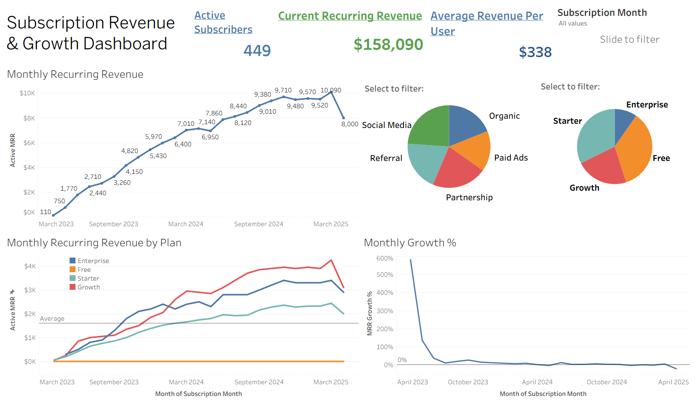

# SaaS Analysis

## Project Overview
This music streaming company relies on subscriptions for revenue. Analyzing customer engagement and retention over time is a key aspect of projecting growth and evaluating the success of implemented features and updates. 

## Objective
Evaluate the effectiveness of the new *Collaborative Playlist* feature by evaluating customer engagement from launch through two years. 

##Key Questions
* Did the “Collaborative Playlist” feature (approximated by early upgrade) increase
retention?
* Which user segment has the highest churn risk, and what recommendations can be made to increase engagement for those users?
* What is the current MRR growth trend? Is it accelerating or slowing?

## Tools used
* SQL
* Tableau

## Preview
A screen recording of the dashboard's interactivity can be accessed in files (called saas_dashboard.mp4). A preview of the dashboard is below.

## Process
1. Exploration of the dataset - The exploration notebook lists questions, queries, and answers and can be found in files.
2. SQL queries to dig deeper into the dataset - The query notebook lists the code used for the findings.
3. Create visualizations in Tableau to show the relationships between revenue and subscription. This included using Tableau to calculate monthly recurring revenue (MRR), active MRR, average revenue per user, MRR growth percentage, and active subscribers. This further aids analysis and readies the dashboard.
4. Analyze the results and create a dashboard for stakeholders.

## Analysis

